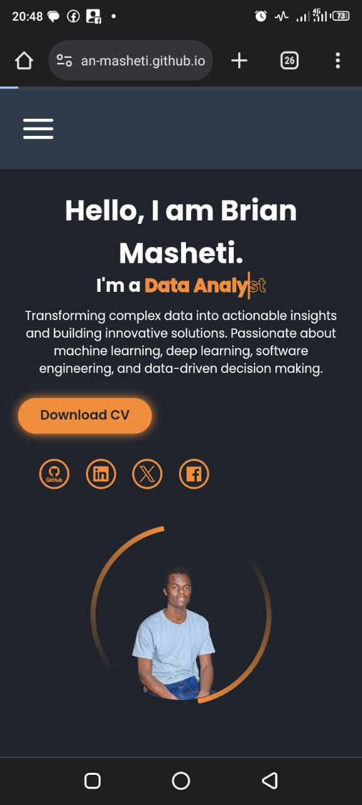

# Brian Masheti Portfolio

Welcome to my portfolio website! I'm Brian Masheti, a data analyst and aspiring software engineer (Full-stack MERN developer) passionate about using data to drive decisions and build innovative solutions. This site showcases my skills, projects, education, interests, and a way to contact me.

**Live Website:** [https://brian-masheti.github.io/Website-Portfolio/](https://brian-masheti.github.io/Website-Portfolio/)

## Features

- **Responsive Design**: Works seamlessly on desktop, tablet, and mobile.
- **Navigation**: Sections include Home, About Me, Programming Languages, Education, Interests, Projects, and Contact.
- **Contact Form**: Functional form via Formspree to send messages to my email.
- **Download CV**: Buttons in Home and Footer link to my resume on Google Drive.
- **Social Media Links**: Links to LinkedIn, GitHub, X, and Facebook in Home and Footer.
- **Styling**: Starry night background, gradient footer, and animated navbar with mobile hamburger menu.
- **Back to Top**: Footer button for easy navigation to the top.
- **Animations**: Typing effect in Home and rotating border around the profile image.

## Technologies Used

- **HTML5**: Website structure.
- **CSS3**: Styling, animations, gradients, and responsive design.
- **External Libraries**:
  - [Boxicons](https://boxicons.com/) for footer social media icons.
  - [Devicon](https://devicon.dev/) for Home social media icons.
  - [Material Symbols](https://fonts.google.com/icons) for Contact section icons.
  - [Google Fonts](https://fonts.google.com/) for Poppins font.
- **Formspree**: Handles contact form submissions.
- **Google Drive**: Hosts the CV file (`BrianMashetiResume.pdf`).

## Setup Instructions

1. **Clone or Download**:
   - Clone via Git:
     
     ```bash
     git clone https://github.com/Brian-Masheti/Website-Portfolio.git
     ```
     
   - Or download the ZIP file and extract it.
     
=======
1. **Clone or Download the Project**:
   - If using Git: `[git clone <repository-url>](https://github.com/Brian-Masheti/Website-Portfolio.git)` (once hosted on GitHub).
   - Alternatively, download the project files as a ZIP and extract them.


2. **Open the Project**:
   - Navigate to the project folder.
   - Open index.html in a browser (e.g., Chrome, Firefox).

3. **Dependencies**:
   - Requires an internet connection to load CDNs:
     - Boxicons: `<link href="https://unpkg.com/boxicons@2.1.4/css/boxicons.min.css" rel="stylesheet">`
     - Devicon: `<link rel="stylesheet" href="https://cdn.jsdelivr.net/npm/devicon@2.15.1/devicon.min.css">`
     - Material Symbols: `<link rel="stylesheet" href="https://fonts.googleapis.com/css2?family=Material+Symbols+Outlined:opsz,wght,FILL,GRAD@20..48,100..700,0..1,-50..200" />`
     - Google Fonts: `<link href="https://fonts.googleapis.com/css2?family=Poppins:wght@300;400;500;600;700;800;900&display=swap" rel="stylesheet">`
   - No additional installations are needed (pure HTML/CSS).

## Deployment

- **Live URL**: [https://brian-masheti.github.io/Website-Portfolio/](https://brian-masheti.github.io/Website-Portfolio/)
- **Hosting on GitHub Pages**:
  1. Pushed the project to a public GitHub repository (Brian-Masheti/Website-Portfolio).
  2. Enabled GitHub Pages in the repository settings, using the main branch.
  3. The site is now live at the provided URL.
- **CV Hosting**: The CV (BrianMashetiResume.pdf) is on Google Drive: Download CV.

## File Structure

```
brian-portfolio/
├── index.html              # Main HTML file
├── Styles/                 # CSS folder
│   └── styles.css          # Styling file
├── Images/                 # Images folder
│   ├── logo1.png           # Portfolio logo
│   ├── background.jpeg     # Starry night background
│   ├── profile-pic.png     # Home section profile picture
│   ├── journey-pic.jpg     # About Me section image
│   ├── home.png            # Home section screenshot
│   ├── dashboard.png       # PowerBI dashboard screenshot
│   ├── education.png       # Education section screenshot
│   ├── contact.png         # Contact section screenshot
│   ├── mobile.png          # Mobile view screenshot
│   └── footer.png          # Footer screenshot
└── README.md               # Documentation
```

**Note**: The CV (**_BrianMashetiResume.pdf_)** is hosted on Google Drive.

## Usage

- **Navigation**: Use the fixed navbar to access sections (**Home, About Me**, etc.).
- **Download CV**: Click "Download CV" in Home or Footer to get my resume.
- **Social Media**: Click icons (**LinkedIn, GitHub, X, Facebook**) in the Home or Footer to visit my profiles.
- **Contact**: Use the Contact section form to send a message via Formspree.

## Screenshots

### Home Section


### Mobile View (Home)


### Contact Section


### PowerBI Sales Dashboard


### Education & Certification Section


### Footer


## Contact Information

- **Email**: savabrian92@gmail.com
- **Phone**: +254 741 754 002
- **LinkedIn**: [https://linkedin.com/in/brian-masheti](https://linkedin.com/in/brian-masheti)
## Acknowledgments

- **Formspree**: For form submission handling.
- **GitHub Pages**: For hosting the website.
- **Google Fonts**: For the Poppins font.
- **Boxicons, Devicon, Material Symbols**: For icons used in the site.

**🤗 🏛️ Built with ❤️😍 by Brian Masheti 🖥️**
